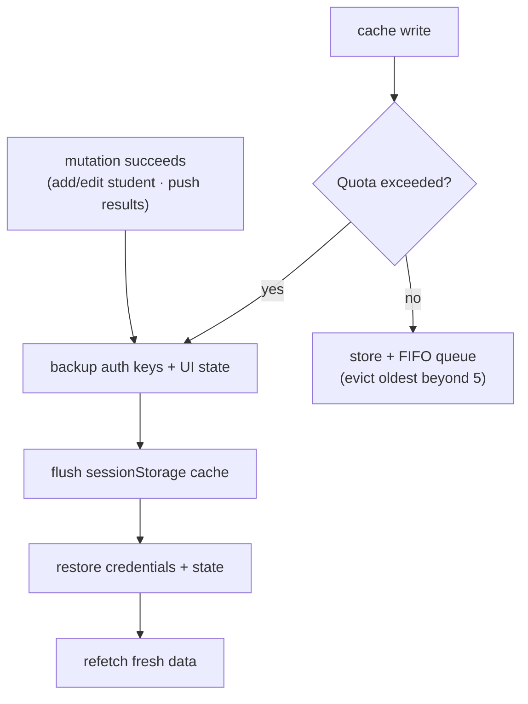

# 🎓 ScoreLens — Exam Analytics & AI Tutoring Platform (Frontend)

> A React (Vite) single-page app for **coaching institutes** running competitive-exam test series (JEE Mains / Advanced, EAPCET, and similar) — live leaderboards, per-student analytics dashboards, a streaming AI assistant with file sharing, and passwordless SMS-OTP login. **In production** with an institute today, and built to be **rebranded for any institute by swapping a logo and three CSS variables**. Pairs with the [ScoreLens Spring Boot backend](https://github.com/Premanshu-jha/OMR).


---

## ✨ Feature Tour

### 🔐 Passwordless OTP Login
Roll-number-first login with a polished 4-digit OTP experience: **segmented input boxes** with auto-advance on type, backspace navigation, and smart paste handling (paste a 4-digit code anywhere and it distributes across boxes). A live **15-minute countdown timer** (matching the backend's Redis OTP TTL) gates resend requests and disables the form on expiry. On success, the JWT is decoded client-side (`jwt-decode`) into a session profile — no extra "who am I" API call needed. The login card carries the institute's logo and name — both configurable.

### 🧭 Role-Based Navigation & Routing
- **`ProtectedRoute`** guards every page: checks token presence *and* expiry from the JWT payload, cleans up the session and redirects to login when stale.
- **`RoleBasedRedirect`** sends each user to their home: students land on *their own report*, admins land on the *student directory*.
- The sidebar renders **different navigation per role** — students see "My Report"; admins additionally get "Student Directory" and "Upload Results". Fully responsive with a mobile hamburger, slide-in drawer, and blurred overlay.

| Route | Page | Access |
|---|---|---|
| `/login` | OTP login | Public |
| `/` | Role-based redirect | → student's report or admin directory |
| `/student/:id/report` | Student analytics dashboard | Protected |
| `/leaderboard` | Live leaderboards | Protected |
| `/directory` | Student directory (CRUD) | Protected (admin nav) |
| `/upload` | Exam results uploader | Protected (admin nav) |
| `/documents` | Document repository | Protected |
| `/chat` | AI assistant | Protected |

### 🏆 Live Leaderboards
Exam-category tabs (JEE-MAINS · JEE-ADVANCED · EAPCET) with exam-name search, rendering each exam as an animated **accordion card**. Inside: a paginated rank table with server-side filters (name / city / roll number — with a datalist of common coaching-hub cities), **gold/silver/bronze podium badges** for the top three, top-tier row highlighting, and a client-computed **accuracy badge** (correct ÷ attempted) color-coded green/amber/red.

### 📊 Student Report Dashboard
A branded gradient profile header (name, roll no, class, city, phone) above **exam-category tabs**. The dashboard **discovers subjects dynamically** from the API response shape (any `*AttemptedQuestions` field becomes a subject) — so an institute adding new subjects sees them appear without any frontend changes. Shows per-subject and overall **average score cards** with percentages, **pure-CSS bar charts** of score trends per subject (no chart library — gradient bars with hover tooltips), and per-exam accordions with full mark breakdowns.

### 🤖 AI Assistant (Streaming Chat)
- **True token-by-token streaming**: reads the SSE response with a manual `ReadableStream` reader + `TextDecoder`, buffering partial lines and appending parsed `data:` chunks live into the last message bubble.
- **Markdown rendering** with GitHub-flavored tables and styled code blocks (`react-markdown` + `remark-gfm`).
- **File sharing with the bot**: attach a PDF/image/CSV — it uploads and ingests *immediately* (so the model can discuss it the moment you hit send), shows a removable pending-file chip, and removing it calls the backend to delete both the stored file *and* its vector embeddings. Extension-aware file icons throughout.
- Chat history loads from the backend on mount — including LLM-summarized archived context.

### 📁 Document Repository
File table with extension-coded icons, sizes, and upload dates. Downloads use the backend's **one-time-ticket flow**: fetch a 30-second ticket with the JWT, then redirect the browser to the ticketed download URL — native browser downloads without exposing an open endpoint.

### 🗂️ Student Directory (Admin)
Card-grid CRUD: inline add/edit forms on the cards themselves (including a styled toggle for the SMS-OTP bypass flag), role badges, filters with city datalist, and pagination.

### 📤 Upload Exam Results (Admin)
Guided **two-step** uploader for the CSV→PostgreSQL pipeline: step one stores the CSV in file storage, step two triggers the bulk database ingestion — with disabled-zone progression so steps can't run out of order, CSV-only validation, selected-file preview, and animated success/error/loading status alerts that surface the backend's actual response messages. After a successful push it **invalidates the entire session cache** (using the same credential-preserving flush as the cache manager), so leaderboards and reports immediately reflect the newly ingested exam instead of stale cached pages.

---

## 🧠 Engineering Highlights

### Smart Caching & Cache Invalidation Strategy (`cacheManager.js`)
Client-side caching is a trade-off between **speed and staleness** — most apps pick one and suffer the other. This app is engineered to win both sides: repeat navigation never re-fires an API call the cache can answer, **and no screen can ever display outdated data**, because the cache's lifecycle is tied to the app's write operations. API responses (leaderboards, directory pages, reports) are cached in `sessionStorage` behind a small **FIFO eviction queue** (max 5 entries), and three deliberate behaviors make the whole thing safe:

- **Write-through invalidation** — every mutation flushes the read cache: creating or editing a student (POST/PUT) and pushing exam results each trigger a full cache flush before refetching, so no page can ever display pre-mutation data. Reads are cached aggressively *because* writes invalidate ruthlessly.
- **Credential-preserving flush** — every flush (and the `QuotaExceededError` recovery path) **backs up protected keys** (`authToken`, `studentSession`), clears storage, and **restores the credentials** — neither cache pressure nor invalidation can ever log the user out.
- **Persisted UI state** — the directory's page number, filter type, and filter value are stored through the same cache (with lazy `useState` initializers), so navigating away and back restores exactly where the admin left off — and this state is deliberately re-saved after each flush.



### SSE Streaming Without a Library
The chat consumes the backend's `text/event-stream` by hand — `response.body.getReader()`, chunk decoding with `{ stream: true }`, line-buffer splitting to survive chunks that cut mid-line, and defensive JSON parsing per `data:` event. A **dedup guard** (append only if the bubble doesn't already end with the incoming chunk) keeps the UI correct even under React StrictMode double-invocations or repeated events, and the UI is **optimistic** — the user's message and an empty assistant bubble render instantly, with tokens streaming into it.

### Attachment Metadata That Survives History
Attached files are recorded *inside the message content* using an `[Attached: filename]` convention: the display layer strips it from the visible text and re-renders it as a proper file chip with an extension-aware icon — which means attachments reappear correctly even when history is **reloaded from the server**, where only message text persists. The pending-attachment flow is equally careful: picking a new file first deletes the previous pending upload (file *and* its vector embeddings), and a removable chip lets the user back out before sending — the vector store never accumulates orphaned files.

### Deliberate Interaction Patterns
- **Committed search** — leaderboard search fires only on explicit submit (button/Enter), not per keystroke, keeping API traffic and cache churn low; changing exam tabs resets search and collapses accordions.
- **Guarded destructive actions** — file deletion requires confirmation, then updates the list optimistically.
- **Race-proof forms** — inputs and buttons disable during uploads and streams, with state-aware labels ("Uploading…", "Processing…", "Please wait…").

### Stateless Session, Client-Verified
The app never stores user details separately from the token — the JWT *is* the session. `jwt-decode` extracts the profile at login, `ProtectedRoute` re-checks expiry on every navigation, and logout is just `sessionStorage.clear()`.

### White-Label Design System
The entire UI derives from a **three-variable brand theme** applied via CSS custom properties on every page — rebranding for a different institute means changing a logo file and these tokens:

| Token | Example value | Role |
|---|---|---|
| `--primary-dark` | `#0b2241` | Headers, buttons, sidebar |
| `--primary-teal` | `#199fa6` | Accents, focus rings, active states |
| `--accent-green` | `#3ab55b` | Success states, growth indicators |

Plus shared patterns everywhere: brand-tinted focus states and shadows, spinner loaders, animated accordions (CSS grid `0fr → 1fr` trick), and podium/accuracy badge components.

---

## 🔌 Backend Integration

All calls go through `VITE_API_BASE_URL` with the JWT in the `Authorization` header:

| Page | Endpoints used |
|---|---|
| Login | `POST /api/auth/generate-otp`, `POST /api/auth/verify-otp` |
| Leaderboards | `GET /api/exams?type=`, `GET /api/exams/{id}?pageNumber=&pageSize=&…filters` |
| Student Report | `GET /api/students/{id}/report` |
| Directory | `GET/POST /api/students`, `PUT /api/students/{id}` |
| Documents | `GET /api/file`, `GET /api/file/generate-ticket/{id}`, `GET /api/file/download/{id}?ticket=`, `DELETE /api/file/delete/{id}` |
| AI Assistant | `POST /api/chat/{userId}/stream-chat` (SSE), `GET /api/chat/{userId}/chat-history`, `POST /api/chat/upload`, `DELETE /api/chat/delete/{fileId}` |
| Upload Results | `POST /api/file/bulk-update` |

---

## 🗂️ Project Structure

```
src/
├── App.jsx                  # Route table: public /login, RoleBasedRedirect at /,
│                            # six protected pages under ProtectedRoute + Layout
├── main.jsx                 # React 18 StrictMode entry
├── components/              # One folder-mate pair per page: Component.jsx + Component.css
│   ├── Login · Layout · ProtectedRoute · RoleBasedRedirect
│   ├── Leaderboard · LeaderboardAccordion · StudentReport · StudentList
│   ├── ChatStreaming · DocumentViewer · UploadExamResults
│   └── cacheManager.js      # FIFO cache + invalidation + quota recovery
└── assets/                  # Branding & the in-house icon system
    ├── utils.jsx            # ~30-icon SVG library (Icon component with name/size/color
    │                        # props) + extension-aware getFileIcon (PDF/Excel/Word/image)
    ├── <institute logo>.png # Swappable brand logo (login card + favicon)
    └── hero.png · *.svg     # Landing/brand imagery
```

The **assets layer is the white-label boundary**: all branding lives in one folder (logo files) plus the CSS `:root` tokens, while `utils.jsx` gives every page a consistent icon language — subject icons (physics/maths/chemistry), navigation, file types, and actions — with zero external icon dependencies.

---

## 🛠️ Tech Stack

| Concern | Choice |
|---|---|
| Framework | React (SPA) on Vite |
| Routing | react-router-dom with protected + role-based routes |
| Markdown | react-markdown + remark-gfm |
| Auth | jwt-decode, sessionStorage |
| Icons | Custom in-house SVG icon system (~30 icons, zero icon-library dependency) |
| Charts | Pure CSS bar charts — zero chart-library dependency |
| Styling | Hand-written CSS with a shared variable-based design system |

---

## 🚀 Getting Started

```bash
# 1. Install
npm install

# 2. Configure — create .env
#    VITE_API_BASE_URL=http://localhost:8080   (your backend URL)

# 3. Rebrand (optional)
#    - Replace the logo in src/assets/
#    - Update the three brand tokens in the CSS :root blocks
#    - Set your institute name in the Login and Layout components

# 4. Run
npm run dev
```

> Requires the [ScoreLens backend](https://github.com/Premanshu-jha/OMR) running with PostgreSQL, MongoDB, and Redis.

---

## 📌 Key Takeaways

- **Production SPA** with real users — role-aware routing, responsive layout, and a white-label design system any institute can adopt
- **Hand-rolled where it counts** — SSE stream parsing, CSS charts, and an SVG icon system instead of heavyweight dependencies
- **Resilient client caching** — FIFO-evicted session cache with write-through invalidation on every mutation, credential-preserving flushes, and persisted UI state
- **Tight backend contract** — ticket-based downloads, immediate file ingestion for chat, and JWT-as-session throughout
